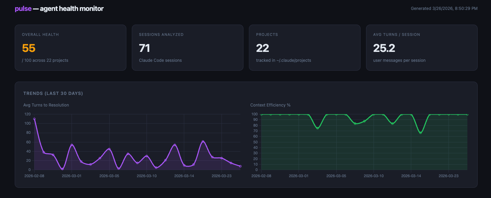

# Pulse: Agent Cognition Observability

We can all see our AI API bills. What we can't see is the actual metabolism of our coding agents.

Is session 30 more efficient than session 5? Is the agent re-reading the exact same files in an infinite loop? Is the context memory you spent tokens building actually being utilized?

**Pulse** is a local observability tool that reads the JSONL session transcripts your agent (like Claude Code) already writes to disk, and turns them into a health dashboard.



---

## The Problem: AI Metabolic Disorders

You wouldn't run a backend service without instrumenting it to catch performance regressions. But right now, we let AI agents write production code without any observability into their cognition loops.

When I ran Pulse against my own local projects, the data was jarring:

- **Unhealthy projects:** 70% file revisit rate. The agent re-read the exact same files 7 out of 10 times. Pure token waste.
- **Healthy projects:** Tight sessions, 100% cache reuse, low revisit rates.

Pulse is the thermometer, not the doctor. It won't fix your codebase, but it will tell you exactly where your architecture is causing the LLM to thrash.

---

## Core Metrics

Pulse parses your transcripts to calculate four key indicators:

1. **File Revisit Rate** — The percentage of times an agent reads a file it has already read in the same session. High rates indicate thrashing or missing context.
2. **Turns to Resolution** — How many back-and-forth prompts it takes to close a task. Tracks whether the agent is getting smarter over time, or degrading as context windows bloat.
3. **Context Efficiency** — Ratio of cache-read tokens vs. total input tokens. Low values mean you're paying for context the model already processed.
4. **Memory Utilization** — Is the agent actually querying the local project memory it generated in previous sessions?

---

## Zero Cloud. Zero API Keys.

Pulse runs 100% locally. It parses the transcript files already sitting on your hard drive.

- No data leaves your machine.
- No API keys required.
- No telemetry.

---

## Quick Start

```bash
# Clone the repository
git clone https://github.com/michaewahl/pulse.git
cd pulse

# Install dependencies
npm install

# Scan all projects and print a quick summary
npx tsx src/cli.ts stats

# Generate the full HTML dashboard
npx tsx src/cli.ts analyze --open

# Scope to a single project
npx tsx src/cli.ts analyze --project /path/to/your/project
```

Pulse reads from `~/.claude/projects/` — the directory Claude Code uses to store session transcripts and memory files. No configuration needed.

---

## How It Works

Claude Code writes a JSONL file for every session to `~/.claude/projects/<project-slug>/<session-id>.jsonl`. Each line is a JSON event — user messages, assistant responses, tool calls, token counts. Pulse parses these files, filters out tool result callbacks (which inflate turn counts), and computes the four metrics per session.

The HTML dashboard is a single self-contained file with Chart.js for trend lines and sparklines. No server, no build step.

---

## Roadmap

Pulse is product 1 of a planned three-product stack:

- **Pulse** — observe the problem ← *you are here*
- **ContextIQ** — fix it (selective attention engine that curates context before sessions start)
- **AgentKit** — build agents that maintain themselves (memory consolidation, drift detection, background maintenance)

---

## Contributing

Issues and PRs welcome. If you run Pulse against your own projects and find interesting patterns, open an issue — real-world data is the best way to improve the metrics.

---

*Built with Claude Code. The irony is intentional.*
